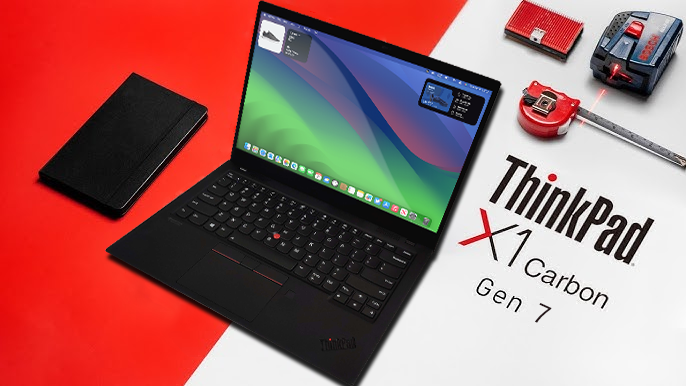
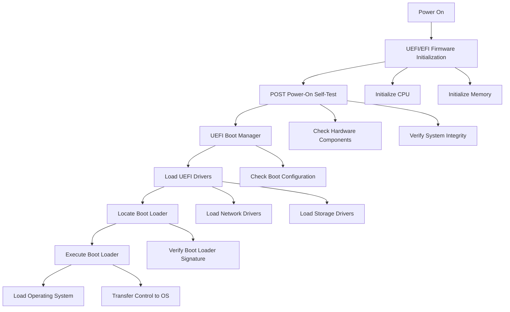

# Hackintosh on Lenovo ThinkPad X1 Carbon Gen 7

<p align="center">
<a href="https://www.apple.com/macos/sonoma/">
   </a>
<a href="https://pcsupport.lenovo.com/br/en/products/laptops-and-netbooks/thinkpad-x-series-laptops/thinkpad-x1-carbon-7th-gen-type-20qd-20qe/downloads/driver-list/component?name=BIOS%2FUEFI">
   </a>
<a href="https://psref.lenovo.com/Fullscreen/ThinkPad_X1_Carbon_7th_Gen">
   </a>
<a href="https://github.com/acidanthera/OpenCorePkg">
   </a>
<a href="https://github.com/tylernguyen/obsidian-horizon/blob/main/LICENSE">
   
 </a>
</p>

<p align="center">
<a href="https://github.com/mamunaco/X1C7-OpenCore-Hackintosh/issues?q=is%3Aissue+label%3A%22help+wanted%22+is%3Aopen">
   </a>
<a href="https://github.com/mamunaco/X1C7-OpenCore-Hackintosh/commits/master"> 
   </a>
<a href="">
	 </a>
<a href="https://github.com/sponsors/mamunaco">
    </a>
<a href="">
    </a>
</p>

<p align="center">
<a href="">
    </a>
</p>

#### **Status: Stable | Daily driver**

This is another repository created by another ordinary person focused on implementing **`MacOS`** on the **`Lenovo ThinkPad X1 Carbon Gen 7`** (or, as I like to say, **Lenovo ThinkTosh X1C7** 😎).

**INTRO:** This project was created for people who are interested in seeing how it would be if we could implement **`MacOS`** on a laptop that wasn't manufactured by _Apple_ and could be used like a **`MacBook`** by spending less (**a lot less!**) or even reusing your laptops for productivity, programming, work, entertainment, enthusiasts, etc.

Since late 2023, I've been working to understand how I can develop a way to implement **`MacOS`** on the **`Lenovo ThinkPad X1`** (especially the _7th Gen version_), and since then, I've been enhancing the core of the project (`config.plist`) to make the experience as good as possible without encountering problems or experiencing lagging. If you need help with any problem that appears, please visit. [Reddit](https://www.reddit.com/r/hackintosh/), [TonyMacX86](https://www.tonymacx86.com), [call Copilot if you are Gen Z](https://www.bing.com/chat?q=Microsoft+Copilot) or [just Google if you are like a boss](https://www.google.com).

## Introduction

- **[Observations](#observations)**
	- [Information about EFI/BOOT](#information-about-efiboot)
	- [What is working](#what-is-working)
	- [What is not working](#what-is-not-working)
	- [Needs to fix](#needs-to-fix)
	- [Hardware](#hardware)
	- [Software](#software)
	- [ACPI](#acpi)
	- [Kexts](#kexts)
	- [UEFI](#uefi)
- **[Tutorial](#tutorial)**
	- [Configuring your custom SMBIOS](#configuring-your-custom-smbios)
	- [Editing the configuration file](#editing-the-configuration-file)
	- [Downloading MacOS Sonoma 14](#downloading-macos-sonoma-14)
	- [Preparing your flash drive BOOT](#preparing-your-flash-drive-boot)
	- [Configuring UEFI](#configuring-uefi)
	- [Moving EFI](#moving-efi)
- **[POST](#post)**
	- [Trackpad](#trackpad)
	- [SMBIOS](#smbios)
	- [audio](#audio)
- **[Credits](#credits)**
	- [Other repositories](#other-repositories)
	- [Folks](#folks)

> [!NOTE] Note
> All tutorial here was made by **`Windows 10`**. If you are using **`MacOS`** or **`Linux`** as a primary OS, maybe some commands be different. So be careful!


> [!CAUTION] Caution
> I'm not responsible for any **problems** or **damages** that **could possibly occur** on your laptop if you follow the tutorial below. The procedures transcribed in this repository were executed on the **GitHub user's laptop** and shared with the community for knowledge purposes without any obligation or warranty of success. By following these steps, **YOU TAKE ALL RESPONSIBILITY IF YOU TRY TO REPLICATE THESE ONES**.

## Observations

<p align="center">
<a href="">
    </a>
</p>

### Information about EFI/BOOT
One of the most important things to know is how **`MacOS`** boot works, the steps before **POST**, and how **EFI**/**Firmware** deal with understanding each line inserted in our **OpenCore** config (`config.plist`), **ACPI** files, kernel extensions, drivers, etc.

Once you have a basic knowledge about **UEFI**/**BOOT**, the minimum requirements that will be useful to boot the OS are to create, edit, and generate your **SMBIOS**, which is nothing more than simulating your laptop as a **`MacBook`** for the OS.

<details>
<summary><strong>EFI/BOOT flowchart 🔃</strong></summary>



</details>

### What is working
<details>
<summary><strong>Working ✅</strong></summary>


> #### Video and Audio
> 
> [](https://github.com/HJebbour/ThinkPad-X1C8-Hackintosh#video-and-audio)

| Feature                              | Status | Dependency                                                                       | Remarks                                                                                                                         |
| :----------------------------------- | ------ | -------------------------------------------------------------------------------- | ------------------------------------------------------------------------------------------------------------------------------- |
| Full Graphics Accleration (QE/CI)    | ✅      | `WhateverGreen.kext` & `AAPL,ig-platform-id` = 00009B3E & `device-id` = A53E0000 | It this configuration doesn't work, change:<br>`AAPL,ig-platform-id`: 00009B3E or 0000A53E<br>`device-id`: 9B3E0000 or A53E0000 |
| Audio Output                         | ✅      | `AppleALC.kext` with Layout ID = 71                                              | -                                                                                                                               |
| Audio Speakers                       | ✅      | `AppleALC.kext` with Layout ID = 71                                              | You have to manually aggregate the two output using "Audio MIDI Setup" to have 4 speakers working                               |
| Audio Input                          | ✅      | `AppleALC.kext` with Layout ID = 71                                              | Headset microphone is inconsistent and needs more testing                                                                       |
| Automatic Headphone Output Switching | ✅      | `AppleALC.kext` with Layout ID = 71                                              | -                                                                                                                               |

> #### Power Management
> 
> [](https://github.com/HJebbour/ThinkPad-X1C8-Hackintosh#power-management)

| Feature                           | Status | Dependency                                         | Remarks                                              |
| :-------------------------------- | ------ | -------------------------------------------------- | ---------------------------------------------------- |
| Battery                           | ✅      | `ECEnabler.kext`                                   | Battery life is native compared to Windows and Linux |
| CPU Power Management (SpeedShift) | ✅      | `CPUFriend.kext` with `CPUFriendDataProvider.kext` | Essential to make a battery management               |
| iGPU Power Management             | ✅      | `SSDT-PLUG.aml`                                    | Essential to use graphics acceleration               |
| NVMe Drive Battery Management     | ✅      | `NVMeFix.kext`                                     | Improves NVMe drive power management                 |
| S3 Sleep / Hibernation Mode 3     | ✅      | `HibernationFixup.kext`                            | Continuously working in improvement                  |

> #### Connectivity
> 
> [](https://github.com/HJebbour/ThinkPad-X1C8-Hackintosh#connectivity)

| Feature                        | Status | Dependency                                                             | Remarks                                                                                                   |
| :----------------------------- | ------ | ---------------------------------------------------------------------- | --------------------------------------------------------------------------------------------------------- |
| WiFi                           | ✅      | `AirportIltwm.kext`                                                    | Related to Wi-Fi connection                                                                               |
| Bluetooth                      | ✅      | `IntelBluetoothFirmware.kext`, `BlueToolFixup.kext`, and `USBMap.kext` | Headset's microphone is not working via Bluetooth                                                         |
| Ethernet                       | ✅      | `IntelMausi.kext`                                                      | -                                                                                                         |
| HDMI 1.4                       | ✅      | BusID patching                                                         | It only works properly after being put to sleep and woken up once (Hotplug & 4K resolution are supported) |
| 1st USB-C (Display output)     | ✅      | -                                                                      | It only works properly after being put to sleep and woken up once (Hotplug & 4K resolution are supported) |
| 2nd USB-C (Display output)     | ✅      | -                                                                      | It works properly (Hotplug is supported)                                                                  |
| USB 2.0 / USB 3.0              | ✅      | `USBMap.kext`                                                          | Create your own USBMap.kext using [CorpNewt](https://github.com/corpnewt/USBMap)                          |
| USB 3.1 (Type-C)               | ✅      | `USBMap.kext` and enable Thunderbolt 3 in `BIOS`                       | Hotplug is working                                                                                        |
| USB Power Properties in macOS  | ✅      | -                                                                      | -                                                                                                         |
| ThinkPad USB-C Docking Station | ✅      | -                                                                      | Work smoothly                                                                                             |

> #### Display, TrackPad, TrackPoint, Keyboard, and Webcam
> 
> [](https://github.com/HJebbour/ThinkPad-X1C8-Hackintosh#display-trackpad-trackpoint-keyboard-and-webcam)

|Feature|Status|Dependency|Remarks|
|:--|---|---|---|
|Brightness Adjustments|✅|`WhateverGreen.kext`, `SSDT-PNLF.aml`, `enable-backlight-smoother` property, and `BrightnessKeys.kext`|`enable-backlight-smoother` property is optional for smoother birghtness adjustments|
|TrackPoint|✅|`VoodooPS2Controller.kext`|-|
|TrackPad|✅|`VoodooI2C.kext` and `VoodooI2CHID.kext`|-|
|Built-in Keyboard|✅|`VoodooPS2Controller.kext`|-|
|Webcam|✅|`USBMap.kext`|-|

> #### macOS Continuity
> 
> [](https://github.com/HJebbour/ThinkPad-X1C8-Hackintosh#macos-continuity)

|Feature|Status|Dependency|Remarks|
|:--|---|---|---|
|iCloud, iMessage, FaceTime|✅|Whitelisted Apple ID, Valid SMBIOS See [Dortania / OpenCore-Install-Guide](https://dortania.github.io/OpenCore-Post-Install/universal/iservices.html)|Switch to itlwm.kext in order to work with macOS Sonoma|
|Sidecar (wired)|✅|-|Tested with iPad Pro M1 with USB-C to USB-C cable|

> #### Miscellaneous
> 
> [](https://github.com/HJebbour/ThinkPad-X1C8-Hackintosh#miscellaneous)

| Feature                       | Status | Dependency     | Remarks                                                                                                                                                                        |
| :---------------------------- | ------ | -------------- | ------------------------------------------------------------------------------------------------------------------------------------------------------------------------------ |
| Multiple Boot                 | ✅      | -              | macOS, Windows, and Linux distributions (Use [this](https://dortania.github.io/OpenCore-Multiboot/empty/samedisk.html#precautions) guide to setup dual boot on the same drive) |
| Boot chime                    | ✅      | -              | Working like a charme                                                                                                                                                          |
| Fan Control / Multimedia Keys | ✅      | `YogaSMC.kext` | I modified YogaSMC.kext in order to work with my setup                                                                                                                         |
| FireVault 2                   | ✅      | -              | Working but the keyboard layout during boot is messed up!                                                                                                                      |

</details>

### What is not working 
<details>
<summary><strong>Not working ❌</strong></summary>


| Feature                      | Status | Dependency                        | Remarks                                                                     |
| :--------------------------- | ------ | --------------------------------- | --------------------------------------------------------------------------- |
| Fingerprint Reader           | ❌      | -                                 | I didn't even get to test                                                   |
| Wireless WAN                 | ❌      | `DISABLED` in BIOS to save power. | Unable to investigate as I have no need and my model did not come with WWAN |
| DRM                          | ❌      | iGPU                              | DRM is broken with iGPUs                                                    |
| Internal Microphone          | ❌      | -                                 | I hope it will work one day                                                 |
| Thunderbolt 3                | ❌      | -                                 | Not working                                                                 |
| Continuity Camera            | ❌      | -                                 | Not working with Intel wireless cards                                       |
| AirDrop                      | ❌      | -                                 | Not working with Intel wireless cards                                       |
| Apple Watch Auto Unlock      | ❌      | -                                 | Not working with Intel wireless cards                                       |
| Instant Hotspot              | ❌      | -                                 | Not working with Intel wireless cards                                       |
| Sidecar (wireless)           | ❌      | -                                 | Not working with Intel wireless cards                                       |
| Continuity Markup and Sketch | ❌      | -                                 | Not working with Intel wireless cards                                       |
| Handoff                      | ❌      | -                                 | Support dropped with macOS Sonoma and the new AirportIltwm kext             |
| Universal Clipboard          | ❌      | -                                 | Support dropped with macOS Sonoma and the new AirportIltwm kext             |
| SMS & Phone Call via iPhone  | ❌      | -                                 | Support dropped with macOS Sonoma and the new AirportIltwm kext             |
| AirPlay to Mac               | ❌      | -                                 | Support dropped with macOS Sonoma and the new AirportIltwm kext             |

</details>

### Needs to fix
<details>
<summary><strong>Needs to fix 🛠</strong></summary>

| Color Banding | Unfortunately, I tried so many configurations and ways to fix the color banding on my ThinkPad model. If you had this problem and was able to resolve, please tell me or open a pull request detailing how to fix this issue. |
| ------------- | ----------------------------------------------------------------------------------------------------------------------------------------------------------------------------------------------------------------------------- |

</details>


### Hardware
This is a little brief of my hardware specifications. Depending on the type of  model or the region where you reside, components may change:
<details>
<summary><strong>Hardware info 💻</strong></summary>


| Category   | Component                                                                                                                                                                      | Note                                                                     |
| ---------- | ------------------------------------------------------------------------------------------------------------------------------------------------------------------------------ | ------------------------------------------------------------------------ |
| Type       | 20QE                                                                                                                                                                           | -                                                                        |
| CPU        | Intel Core i5-8365U                                                                                                                                                            | Whiskey Lake                                                             |
| GPU        | Intel UHD Graphics 620                                                                                                                                                         | Whiskey Lake                                                             |
| SSD        | Intel SSDPEKKF256G8L                                                                                                                                                           | Swapped for compatibility, the laptop came with a Samsung MZ-VLB256B SSD |
| Screen     | 14" FHD - 1920 x 1080                                                                                                                                                          | Touch screen                                                             |
| Memory     | 8GB / 2133MHz LPDDR3                                                                                                                                                           | Soldered                                                                 |
| Battery    | Integrated Li-Polymer 51Wh                                                                                                                                                     | Not removable                                                            |
| Camera     | 720p Camera                                                                                                                                                                    | -                                                                        |
| Wi-Fi & BT | Intel Wi-Fi 6 AX201                                                                                                                                                            | -                                                                        |
| Input      | PS2 Keyboard & Synaptics I2C HID TrackPad                                                                                                                                      | -                                                                        |
| Ports      | 2x USB 3.1 Gen 1 (Right USB Always On)  <br>2x USB 3.1 Type-C Gen 2 / Thunderbolt 3 (Power Delivery and DisplayPort) [Max 5120x2880 @60Hz]  <br>HDMI 1.4 (Max 4096x2160 @24Hz) |                                                                          |


</details>

### Software
| Component    | Version |
| ------------ | ------- |
| OpenCore     | 1.0.1   |
| macOS Sonoma | 14.6.1    |
| ProperTree   | 0.3.0   |
### ACPI

| Components |
| ---------- |
| SSDT-AWAC  |
| SSDT-ECRW  |
| SSDT-PLUG  |
| SSDT-PNFL  |
| SSDT-THINK |
| SSDT-USBX  |
| SSDT-XOSI  |
### Kexts
<details>
<summary><strong>Kexts ⚙</strong></summary>

| AirportItlwm           | 2.3.0 |
| ---------------------- | ----- |
| AppleALC               | 1.9.1 |
| AppleALCU              | 1.9.1 |
| BlueToolFixup          | 2.4.0 |
| BrightnessKeys         | 1.0.3 |
| CPUFriend              | 1.2.8 |
| CPUFriendDataProvider  | 1.2.8 |
| ECEnabler              | 1.0.5 |
| FeatureUnlock          | 1.1.6 |
| HibernationFixup       | 1.5.1 |
| IntelBluetoothFirmware | 2.4.0 |
| IntelBTPatcher         | 2.4.0 |
| IntelMausi             | 1.0.7 |
| IntelSnowMausi         | 1.0.7 |
| Lilu                   | 1.6.8 |
| NVMeFix                | 1.1.1 |
| RestrictEvents         | 1.1.4 |
| SMCBatteryManager      | 1.3.3 |
| SMCProcessor           | 1.3.3 |
| SMCSuperIO             | 1.3.3 |
| USBMap                 |   ❓  |
| VirtualSMC             | 1.3.3 |
| VoodooI2C              | 2.8   |
| VoodooI2CHID           | 2.8   |
| VoodooPS2Controller    | 2.3.5 |
| WhateverGreen          | 1.6.7 |
| YogaSMC                | 1.5.3 |

</details>

### UEFI
<details>
<summary><strong>UEFI 💾</strong></summary>


| Driver          | Version           |
| --------------- | ----------------- |
| AudioDxe        | OpenCorePkg 1.0.1 |
| Ext4Dxe         | OpenCorePkg 1.0.1 |
| OpenCanopy      | OpenCorePkg 1.0.1 |
| OpenLinuxBoot   | OpenCorePkg 1.0.1 |
| OpenHfsPlus     | OpenCorePkg 1.0.1 |
| OpenRuntime     | OpenCorePkg 1.0.1 |
| ResetNvramEntry | OpenCorePkg 1.0.1 |
| ToggleSipEntry  | OpenCorePkg 1.0.1 |


</details>

## Tutorial

### Configuring your custom SMBIOS

Here, we are talking about how you can create your custom **SMBIOS**. Remember that each **SMBIOS** is unique, and because of that, I won't share my full **SMBIOS**.

1. First, download the [GenSMBIOS](https://github.com/corpnewt/GenSMBIOS) generator; 
2. Unzip the files where you can easily access them and open the `GenSMBIOS.bat` file;
3. Click on option 3. Here, the app will download additional packages and, once it finishes, it will shows another screen called *"Generate SMBIOS"*;
4. [Access this page](https://dortania.github.io/OpenCore-Install-Guide/extras/smbios-support.html#how-to-decide) to choose the best **SMBIOS** that you want to use. In my case, I'm using the **`MacBookPro16,3`** **SMBIOS**;
5. Then, an entire **SMBIOS** config will be generated. Copy all the information to Notepad or a similar text editor.

Finished! Now you have your own **SMBIOS** config to proceed to the next step! 🚧🏃‍♂️
### Editing the configuration file

Now, you need to place the information that you copied from **`genSMBIOS`** to you `config.plist`. In this example, we're gonna use the **`ProperTree`** app.

1. Download [ProperTree](https://github.com/corpnewt/ProperTree) app and unzip it in the easy directory;
1. Download all the files of this repository and unzip them in an easily accessible directory.
2. Open the `ProperTree.bat` file and minimize the **`cmd prompt`**. We don't need it and won't use it. **Remember not to close the `cmd prompt`, just minimize it**!
3. Once ProperTree is open, click on _File > Open_ and navigate to the path where you unzipped this repository and open the `config.plist` file (it's located in _EFI/OC/config.plist_).
4. A lot of information will pop up on your screen. To make this more manageable, right-click on the `Root` node and select _“Collapse Children”_.
5. Now, you need to navigate to the path where you will place all the **SMBIOS** information. Click on _PlatformInfo > Generic_ and here are the fields you will fill in:

| MLB                | String | Board Serial |
| ------------------ | ------ | ------------ |
| ROM                | Data   | Apple Room   |
| SystemProductName  | String | Type         |
| SystemSerialName   | String | Serial       |
| SystemUUID         | String | SmUUID       |

There we have it! You've finished the `config.plist` configuration.
### Downloading MacOS Sonoma 14

Now, this is one of the most important steps to do. You will need to download the MacOS image recovery in order to be able to boot up the system on your laptop. An important note to take is that all image paths written inside the `recovery_url.txt` file are legitimate and directly pulled from Apple's domain. So, you don't need to worry about customized or malicious images downloaded via the **`macrecovery`** app.

1. Download [OpenCorePkg](https://github.com/acidanthera/OpenCorePkg) and extract the **`macrecovery`** utility from _Utilities > macrecovery_ into an easily accessible directory on your PC.
2. Now, you can do this in two ways:
    1. Access the folder where you unzipped the file (e.g., _`J:\macrecovery`_), click on the **File** button in the upper-left corner, and select **`Open Windows PowerShell`** or **`Open Command Prompt`** (depending on how your PC is configured).
    2. Open **`Command Prompt`** or **`PowerShell`** by right-clicking on the Windows logo and then typing the path where you unzipped the files (e.g., _`cd J:\macrecovery`_).
3. Once the terminal is configured in the **`macrecovery`** directory, you will need to paste one of the commands below to download the **MacOS Sonoma** image recovery and wait until it finishes:

	```python
	python3 ./macrecovery.py -b Mac-937A206F2EE63C01 -m 00000000000000000 download
	```
	
	```python
	python3 ./macrecovery.py -b Mac-7BA5B2D9E42DDD94 download
	```
4. When the download has finished, you will notice that two files were downloaded (`BaseSystem.chunklist` and `BaseSystem.dmg`).

Well done! Now, you're gonna jump to the final step before trying the first boot up.
### Preparing your flash drive BOOT

Alright, once you have your `config.plist` configured and have downloaded the image recovery, it's time to set up your _flash drive_ (or _pen drive_) to complete this configuration method.

1. Choose your preferred _flash drive_ (or _pen drive_) that will be used in this case. Remember that the device needs to have at least **1GiB** to store all files (I recommend using one with **2GiB** or higher for safekeeping).
2. Format the device with the **FAT32** file system. Otherwise, **you won't be able to boot it on your laptop**!
3. Format options: Quick Format. You can use this option or not. It doesn't matter.
4. Volume Label: `tempEFI` (optional name to identify).
5. When the _flash drive_ (_pen drive_) has been formatted successfully, copy the `EFI` folder that contains the `BOOT` and `OC` folders, respectively (this is the folder where you edited the `config.plist` file!).
6. Then, create a folder named `com.apple.recovery.boot` outside of the EFI folder, and copy and paste the two files that were downloaded by **`macrecovery`** in the previous step (`BaseSystem.chunklist` and `BaseSystem.dmg`).
7. Make a _check-in_ to ensure that you correctly have two folders on your _flash drive_ (_pen drive_): `EFI` and `com.apple.recovery.boot`.

Congratulations, you have completed all the steps successfully! Let's now make some configurations in the **UEFI** on your laptop! 🎖
### Configuring UEFI

This step may vary depending on your **`ThinkPad`** model, **UEFI** version, region, etc. Below, there will be two options to choose from:

1. The most common configuration found in various GitHub repositories;
2. My Configuration.

<details>
<summary><strong>UEFI settings commonly used</strong></summary>

- **Keyboard/Mouse**
    - `Trackpoint` **Enabled**
    - `Trackpad` **Enabled**
- **Display**
    - `Boot Display Device` **ThinkPad LCD**
    - `Total Graphics Memory` **256MB**
    - `Boot Time Extension` **Disabled**
- **CPU**
    - `Intel Hyper-Threading Technology` **Enabled**
- **Thunderbolt**
    - `Thunderbolt BIOS Assist Mode` **Disabled**
    - `Security Level` **No Security**
    - `Support in Pre Boot Environment -> Thunderbolt(TM) device` **Disabled**
- **Security**
	- `Password` **Disabled**
	- `Fingerprint` **Disabled**
	- `Security Chip` **Disabled**
	- `Memory Protection -> Execution Prevention` **Enabled**
	- `Virtualization -> Kernel DMA Protection` **Disabled**
	- `Virtualization -> Intel Virtualization Technology` **Enabled**
	- `Virtualization -> Intel VT-d Feature` **Disabled**
	- `Virtualization -> Enhanced Windows Biometric Security` **Disabled**
	- `I/O Port Access -> FingerPrint Reader` **Disabled**
	- `I/O Port Access -> Wireless WAN` **Disabled**
	- `Secure Boot -> Secure Boot` **Disabled**
	- `Intel SGX -> Intel SGX Control` **Disabled**
	- `Device Guard` **Disabled**
- **Startup**
	- `UEFI/Legacy Boot` **UEFI Only**
	- `CSM Support` **No**
	- `Boot Mode` **Diagnostics** (This can be changed to "Quick" once you know your system is running properly)

</details>
<details>
<summary><strong>My UEFI settings</strong></summary>

- **Keyboard/Mouse**
    - `Trackpoint` **Enabled**
    - `Trackpad` **Enabled**
- **Display**
    - `Boot Display Device` **ThinkPad LCD**
    - `Total Graphics Memory` **256MB**
    - `Boot Time Extension` **Disabled**
- **CPU**
    - `Intel Hyper-Threading Technology` **Enabled**
- **Thunderbolt**
    - `Thunderbolt BIOS Assist Mode` **Disabled**
    - `Security Level` **User Authorization**
    - `Support in Pre Boot Environment -> Thunderbolt(TM) device` **Disabled**
- **Security**
	- `Password` **Disabled**
	- `Fingerprint` **Enabled**
	- `Security Chip` **Enabled**
	- `Clear Security Chip` **Enabled**
	- `Intel TXT Feature` **Disabled**
	- `Physical Presence for Clear` **Enabled**
	- `Memory Protection -> Execution Prevention` **Enabled**
	- `Virtualization -> Kernel DMA Protection` **Disabled**
	- `Virtualization -> Intel Virtualization Technology` **Enabled**
	- `Virtualization -> Intel VT-d Feature` **Enabled**
	- `Virtualization -> Enhanced Windows Biometric Security` **Enabled**
	- `I/O Port Access -> FingerPrint Reader` **Enabled**
	- `I/O Port Access -> Wireless WAN` **Enabled**
	- `Secure Boot -> Secure Boot` **Disabled**
	- `Intel SGX -> Intel SGX Control` **Disabled**
	- `Device Guard` **Disabled**
- **Startup**
	- `UEFI/Legacy Boot` **UEFI Only**
	- `CSM Support` **No**
	- `Boot Mode` **Diagnostics** (This can be changed to "Quick" once you know your system is running properly)

</details>

Once the configurations were done, let's boot this badboy up! 🚀
### Moving EFI

Once you have installed **`MacOS`**, you need to move the `EFI` folder **from the flash drive to the SSD** in order to boot the OS without needing the flash drive every time.

1. Download [MountEFI](https://github.com/corpnewt/MountEFI) and install it on you machine;
2. Then, click on the _Finder_ option on the taskbar and select _“Preferences”_. On the General tab, check the _Hard disks_ option and close the window.
3. The **MacOS HD** folder will appear in the upper-right corner. Right-click on it and select _“MountEFI”_, type your password (if configured), copy the **EFI** folder from the flash drive, and paste it inside the **EFI** folder on your SSD (if the **EFI** folder contains another folder, delete it and paste the **EFI** folder. Only this folder needs to stay there).
4. Close all windows, remove your flash drive, and restart the system. You will notice that **`MacOS`** can now boot up without needing the flash drive.

Congratulations, you have completed all the steps. Now, enjoy your machine! 🕹
## POST

### Trackpad

To improve the Trackpad in **`macOS`**, you have to disable `Force Click and haptic feedback` in *System Preferences -> Trackpad*.
### SMBIOS

Like I said before, I won't share my full **SMBIOS**. But, you can use [GenSMBIOS](https://github.com/corpnewt/GenSMBIOS) to create your own **SMBIOS**. Here is the common **SMBIOS** used for everyone:

- `MacBookPro16,3` - What I used
- `MacBookPro16,2` - Used by others

**Note:** If you use a different **SMBIOS** model than the `MacbookPro16,3` that I've used. The provided USB mapping will not work. You will need to edit the `USBMap.kext` file. You can right click on the file and select **Show Package Contents**. From there you can open the Info.plist file in ProperTree and change `MacBookPro16,3` to whatever Model ID you've chosen. This should provide a working **`USBMap.kext`**.
### Audio

Using the `Layout ID 71` will enable the 4 speakers (top front & bottom rear) in *System Preferences > Sound* allowing you to select either set of speakers (Two Output). To combine the two you'll need to open **`Audio MIDI Setup`** and create `Multi-Output Device` with both sets of speakers. Unfortunately you can't control natively the volume of an Aggregate Device with the volume keys. You'll need to install [AggregateVolumeMenu](https://github.com/adaskar/AggregateVolumeMenu)

## Credits

### Other repositories

Many thanks to those who made it possible to _hackintosh_ my laptop and provided the library for this **`ThinkPad`** series:

- **X1C8-hackintosh repositories:**
	- [HJebbour/ThinkPad-X1C8-Hackintosh](https://github.com/HJebbour/ThinkPad-X1C8-Hackintosh)
- **X1C7-hackintosh repositories:**
	- [seven-of-eleven/Lenovo-ThinkPad-X1C7-OC-Hackintosh](https://github.com/seven-of-eleven/Lenovo-ThinkPad-X1C7-OC-Hackintosh);
	- [aidanchandra/x1c7-hackintosh](https://github.com/aidanchandra/x1c7-hackintosh)
	- [huyhoang8398/x1c7-hackintosh-20R1](https://github.com/huyhoang8398/x1c7-hackintosh-20R1)
	- [EequalsMCsquare/ThinkPad-X1C7-OpenCore](https://github.com/EequalsMCsquare/ThinkPad-X1C7-OpenCore)
- **X1C6-hackintosh repositories:**
	- [tylernguyen/x1c6-hackintosh](https://github.com/tylernguyen/x1c6-hackintosh)
	- [benbender/x1c6-hackintosh](https://github.com/benbender/x1c6-hackintosh)
	- [zhtengw/EFI-for-X1C6-hackintosh](https://github.com/zhtengw/EFI-for-X1C6-hackintosh)

### Folks

I wanna thanks this folks that contributed a lot with the idea of bring **`MacOS`** to our **`ThinkPad`** devices:

- [@benbender](https://github.com/benbender) for your hardwork. Much of this repo comes from your research and code. Thank you!
- [@Fewtarius](https://github.com/fewtarius) for your help with patching audio.
- [@Colton-Ko](https://github.com/Colton-Ko/macOS-ThinkPad-X1C6) for the great features template.
- [@stevezhengshiqi](https://github.com/stevezhengshiqi) for the one-key-cpufriend script.
- [@corpnewt](https://github.com/corpnewt) for [GibMacOS](https://github.com/corpnewt/gibMacOS) and [EFIMount](https://github.com/corpnewt/MountEFI).
- [@xzhih](https://github.com/xzhih) for one-key-hidpi.
- [daliansky/OC-little](https://github.com/daliansky/OC-little) for various ACPI hotpatch samples.
- [@velaar](https://github.com/velaar) for your continual support and contributions.
- [@Porco-Rosso](https://github.com/Porco-Rosso) putting up with my requests to test repo changes.
- [@MSzturc](https://github.com/MSzturc) for adding my requested features to ThinkpadAssistant.
- paranoidbashthot and \x for the BIOS mod.
- [@zhen-zen](https://github.com/zhen-zen) for YogaSMC

Tech thanks for the folks below to keep updating the main kerx, ACP and drivers:

- The guys from [Acidanthera](https://github.com/acidanthera) that make this possible
- [ben9923](https://github.com/ben9923) for [VoodooI2C](https://github.com/VoodooI2C/VoodooI2C)
- [Apple](http://apple.com) for macOS
- [CorpNewt](https://github.com/corpnewt) for [USBMap](https://github.com/corpnewt/USBMap) and [CPUFriendDataProvider](https://github.com/corpnewt/CPUFriendFriend)
- [headkaze](https://github.com/headkaze) for [Hackintool](https://github.com/headkaze/Hackintool)
- [Mieze](https://github.com/Mieze) for [IntelMausiEthernet](https://github.com/Mieze/IntelMausiEthernet)
- [OpenIntelWireless](https://github.com/OpenIntelWireless/IntelBluetoothFirmware/releases) for [IntelBluetoothFirmware](https://github.com/OpenIntelWireless/IntelBluetoothFirmware), [itlwm](https://github.com/OpenIntelWireless/itlwm) and HeliPort
- People at [r/hackintosh](https://www.reddit.com/r/hackintosh/) for their advice and help
- And every other contributor

#### Please let me know if I missed you.💛

